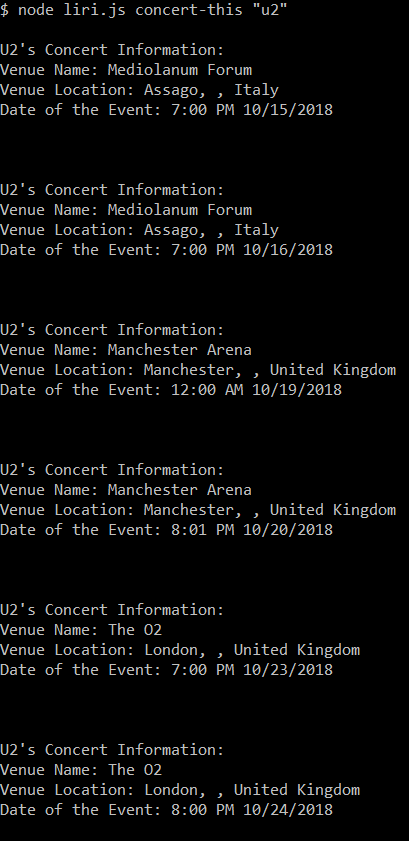
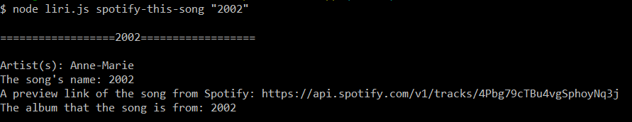
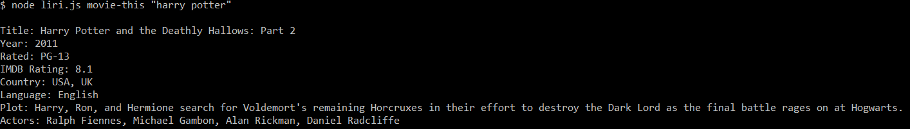
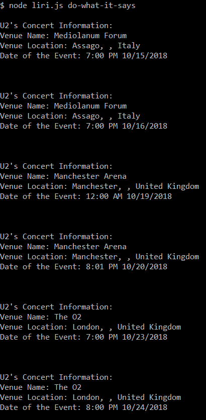

# LIRI node app

## Overview

LIRI is like iPhone's SIRI. However, while SIRI is a Speech Interpretation and Recognition Interface, LIRI is a Language Interpretation and Recognition Interface. LIRI will take in the information you put in and gives you back data.

LIRI will search Spotify for songs, Bands in Town for concerts, and OMDB for movies.

## Github Page

https://csdojo.github.io/liri-node-app/

## bash
git clone 
[Github](git@github.com:csdojo/liri-node-app.git)

## bash how to type in command line

====Concert====
node liri.js concert-this "band/artist(s)'s name"

:heavy_heart_exclamation:

====Spotify====
node liri.js spotify-this-song "name of the song"

:heavy_heart_exclamation:

====OMDB====
node liri.js movie-this "name of the movie"

:heavy_heart_exclamation:

====Do What It Says====
node liri.js do-what-it-says

:heavy_heart_exclamation:

## random.txt input format
type in:
spotify-this-song, "I want it that way" or

movie-this, "batman" or

concert-this,U2    
(!IMPORTANT: please don't include quotation marks around your band/artist)

## file mount
[js#1]:keys.js
[js#2]:liri.js

[json#1]:package-lock.json
[json#2]:package.json

[ignore#1]:.gitignore

[env#1]:.env

[text#1]:random.txt

